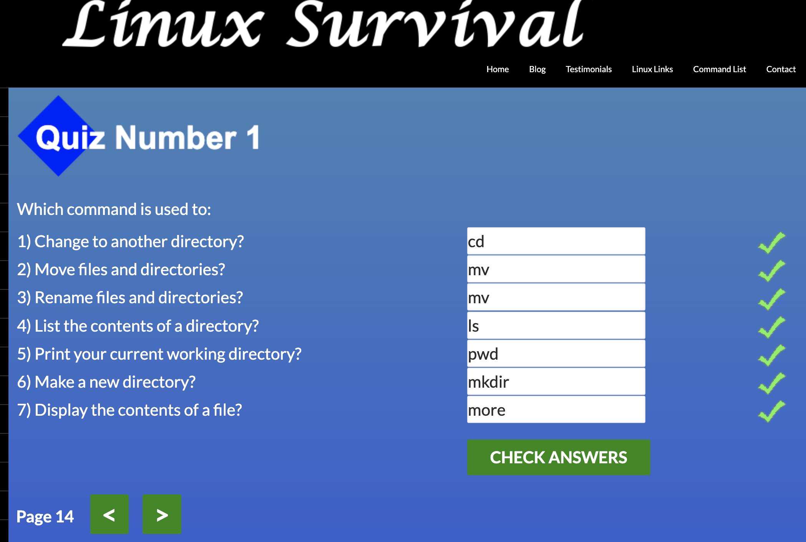
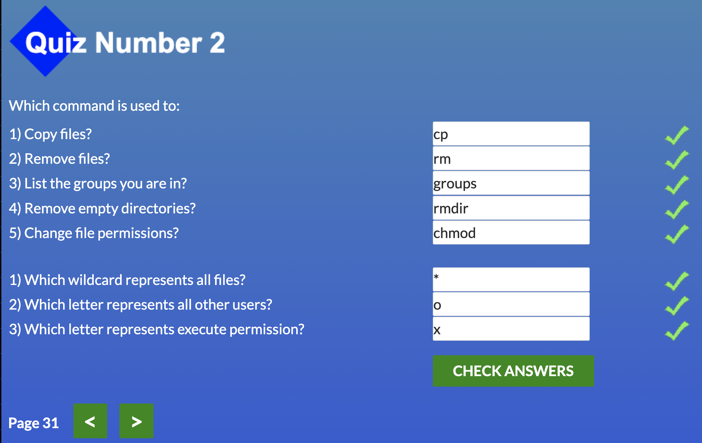
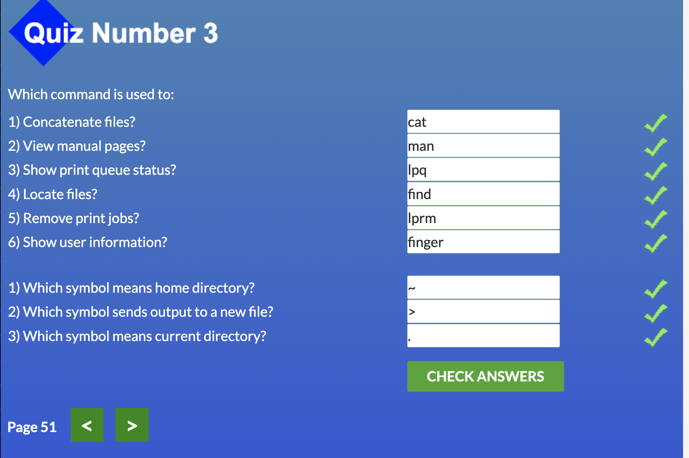
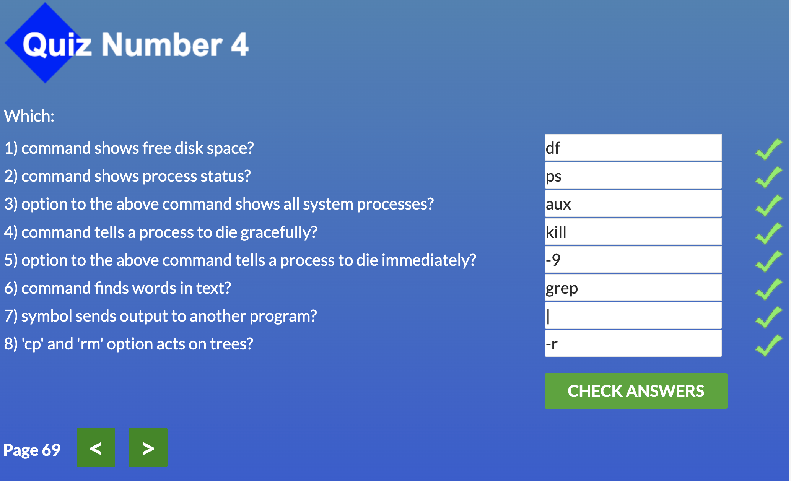
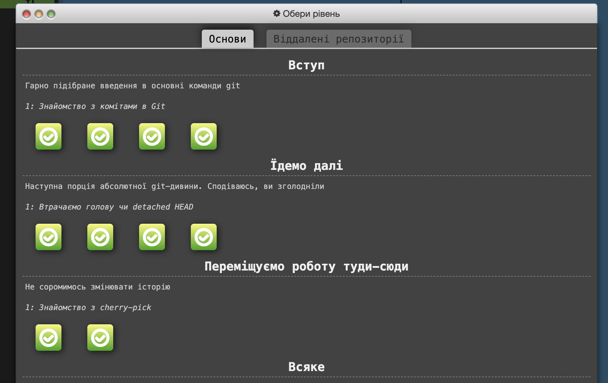
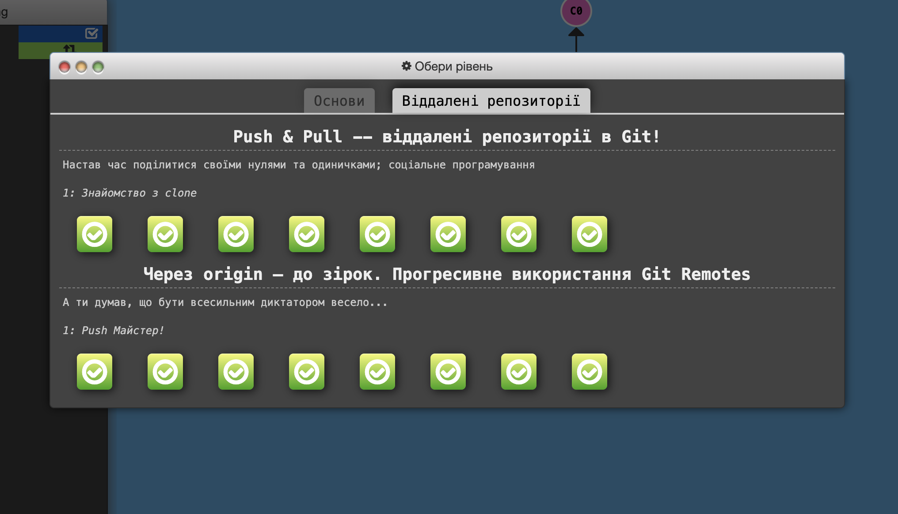
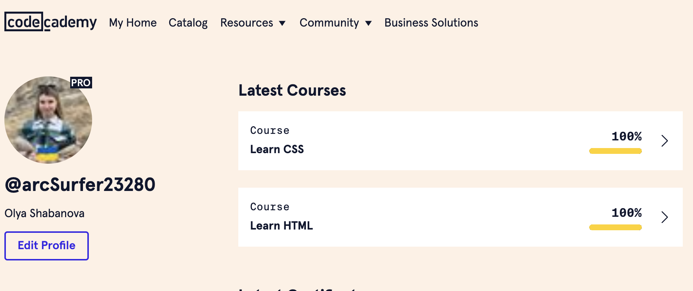
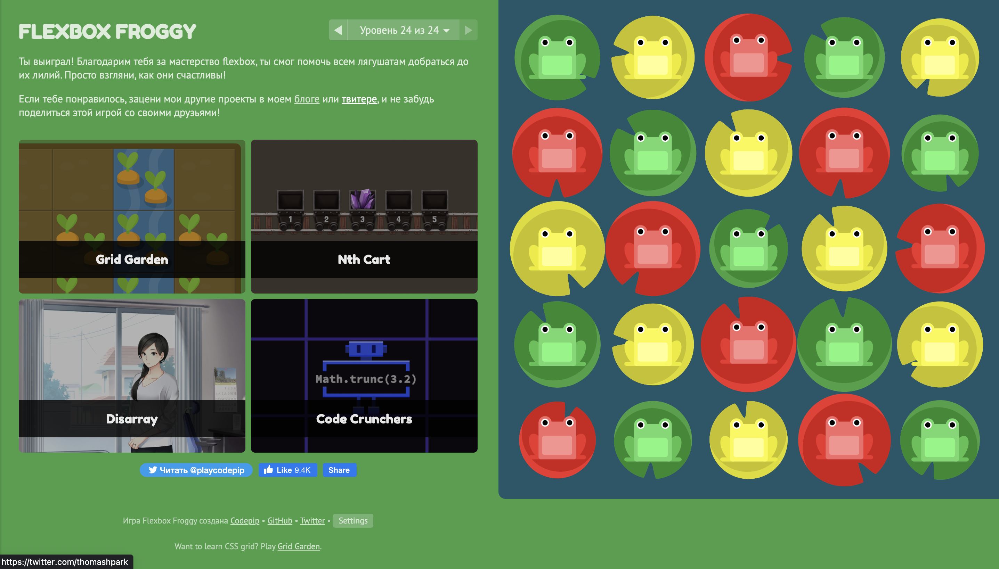
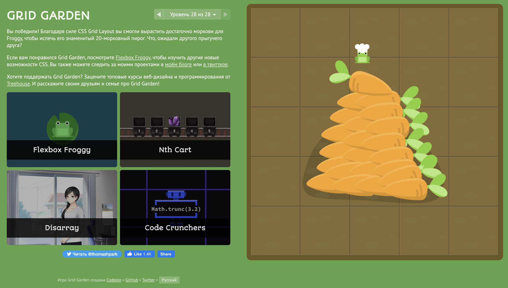

# kottans-frontend

## Git Basics

Дуже сподобався підібраний матеріал по Git темі. Починаючи з coursera, де дуже подробно була розкрита тема, також
сподобався формат https://learngitbranching.js.org/ де в інтерактивній формі можна вивчати й закріпити матеріал. Також
сподобалось, що є багато додаткового матеріалу, за допомогою якого можна закріпити теорію. За TypingClub окрема
подяка :) Якраз думала, що треба навчитися швидкому набору, а тепер знаю де!

## Linux CLI, and HTTP

Quiz 1

Quiz 2

Quiz 3

Quiz 4

До цього курсу в мене були досить базові знання щодо CLI. Завдяки цьому курсу я дізналася більше команд для маніпуляції
з файлами (як обмежити доступ до файлів, як надати права більшій кількості користувачів, як видаляти та перейменовувати
файли, як працювати з деревом, як дізнатися статус процесу та "вбити" шкідливий процес). Ці команди я планую
використовувати і в майбутньому, тому що я працюю на MacOS, а тут наскільки я бачу використовуються якщо не ві ті ж
команди, то принаймні більшість. 

Що стосується HTTP, цей матеріал також був корисний для мене. З нового я дізналася:
- деякі нові методи HTTP (TRACE, OPTIONS)
- Реалізація та типи з'єднань
- Ідентифікація/ Автентифікація, які є шляхи збору інформації про користувачів
- Кешування

## Git Collaboration

Screenshot 1

Screenshot 1

Пройшовши ще одну корисну тему я дізналася для себе багато нового, що й далі планую використовувати:
- Як працювати з віддаленими репозиторіями і гілками (git remote -v, git pull, git fetch etc.)
- Чим відрізняються git pull та git fetch
- Як працювати з pull request
- Під кожну нову фічу треба створювати окрему гілку
- Як вирішувати merge конфлікти

## Intro to HTML and CSS

Screenshot

Загалом мені вже знайомий матеріал з HTML & CSS, але завдяки курсам з coursera та codecademy я повторила матеріал і заповнила деякі свої прогалини:
- повторила всі види селекторів, комбінатори
- overflow
- нарешті до кінця розібралася з позиціонуванням і коли що краще застосовувати (static, relative, absolute, fixed. sticky)
- зрозуміла, що таке z-index
- дізналася про clear property
- ще дізналася, що шрифти можна підключати не тільки за допомогою тегу <link>, але і за допомогою @font-face

Мені дуже сподобалися обидва ресурси, вся інформація була корисна: щось повторила, щось нове дізналася. Все планую використовувати надалі. 

## Responsive Web Design

Responsive Web Design дуже корисна тема, за допомогою вивчення таких технологій як flexbox, grid, свойства @media тепер я знаю як зверстати макет, який на будь-якому пристрої буде виглядати гарно.
Весь матеріал був дуже корисний і прикладний. Прикольно, що за допомогою флексів можно зробити елементи, які зможуть розтягуватись або ставати меншими в залежності від розмиру контенту, тобто флекс допомагає не прив'язуватись до висоти в пікселях, а контейнер буде міняти розмір в залежності від свого контенту. Теж саме і гріди, вони завдяки ним не треба хардкодити блоки.
Мені дуже сподобався підібраний матеріал, як стаття, так і відео. У відео "Фрилансер по життю" дуже детально були розібрані flex та grid, основні властивості. Особливо сподобались практичні відео, за допомогою яких я пропрацювала вивчений матеріал.
Також мені сподобалось опрацьовувати матеріал по іграх Flex Froggy та Grid Garden. 

Flex Froggy

)

Flex Froggy

)

